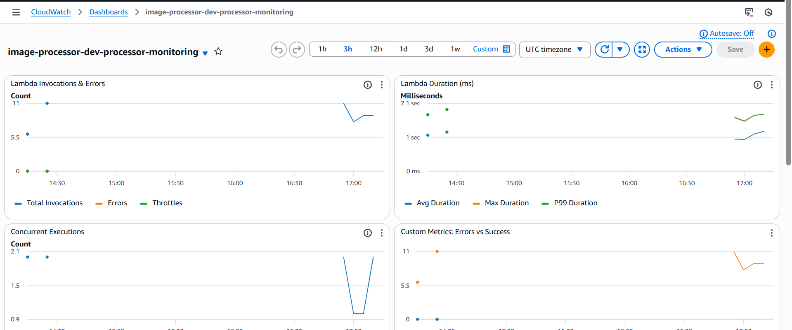
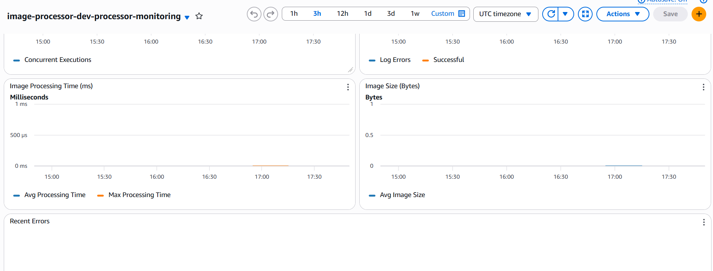
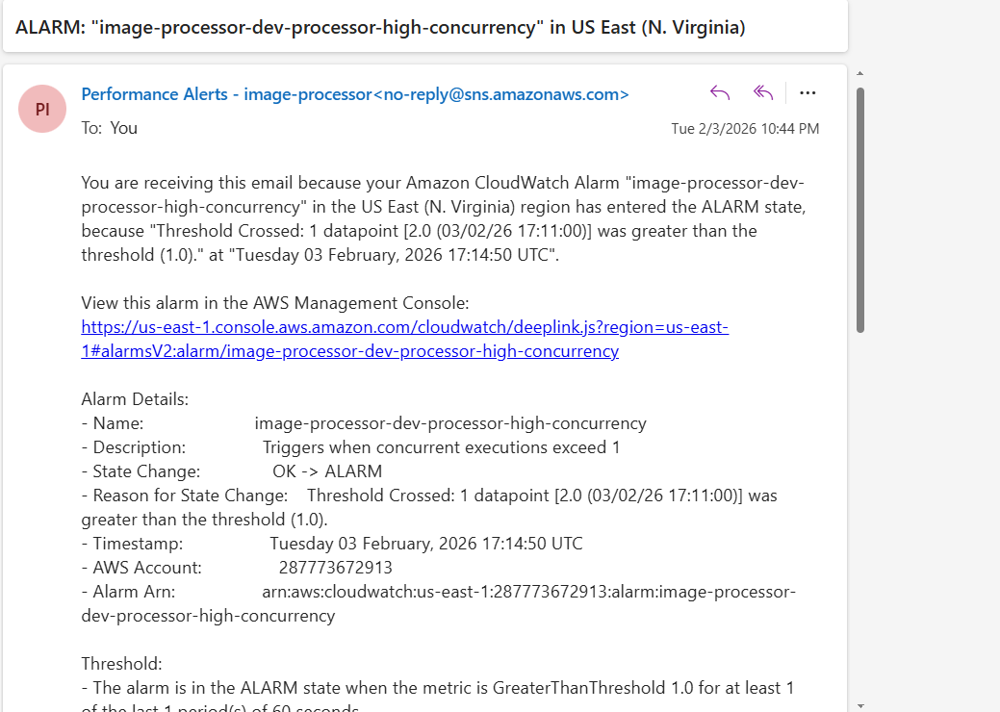

## 📊 AWS Observability Setup Using CloudWatch and Terraform

Set up end-to-end Proactive monitoring and alerting in AWS for your serverless application or component using CloudWatch and Terraform, along with custom metrics, CloudWatch Dashboard and alrams

### 🚀 Overview:

This project demonstrates how to implement end-to-end observability for a serverless AWS application using CloudWatch and Terraform. It leverages built-in Lambda metrics, custom log-based metrics, dashboards, and alarms to provide real-time insights into system performance and behavior.

---

### Live Demo:

CloudWatch dashboard displaying built-in Lambda metrics such as invocation count, average duration, and concurrent executions.

Dashboard showcasing custom metrics extracted from Lambda CloudWatch Logs using metric filters (image size in bytes, processing time).

Email notification triggered by a CloudWatch alarm when Lambda concurrent execution count exceeds the defined threshold which is one for demo purposes only.

---

### Problem:

In production and enterprise-grade systems, applications cannot scale reliably without clear visibility into their internal behavior. Without proper monitoring and observability, teams are unable to answer critical questions such as:

- How is the application behaving in real time?
- Are there performance bottlenecks or hidden failures?
- Are users experiencing delays or errors?
- Is the system scaling effectively under load?
- Do we need to improve availability or capacity planning?

Operating without observability is like driving a car without a speedometer or fuel gauge—issues remain invisible until they cause outages. Telemetry data (metrics, logs, and alarms) provides the foundation for understanding system health, performance, and business impact.

---

### Architecture Diagram:

---

### 🔍 Key Features:

- Event-driven Lambda invocation triggered by S3 object uploads
- CloudWatch dashboards for visualising:
  - Built-in Lambda metrics
  - Custom application-level metrics
- Custom CloudWatch metrics created using metric filters on Lambda logs
- CloudWatch alarms for both built-in and custom metrics
- SNS-based email notifications for alarm events
- Terraform-based infrastructure provisioning
- Multi-environment Terraform setup using reusable modules (dev, staging, production)

---

### 🎯 Learning Objectives:

- Understand observability fundamentals using metrics and logs
- Learn how to monitor AWS Lambda using CloudWatch built-in metrics
- Create and publish custom metrics from application logs
- Design CloudWatch dashboards for real-time monitoring
- Configure CloudWatch alarms for proactive alerting
- Integrate SNS for operational notifications
- Implement event-driven serverless architectures with S3 and Lambda
- Improve system reliability, scalability, and operational visibility

---

### 👨‍💻 Connect with me:

**Ibrar Munir**

Github: https://github.com/ibrarmunircoder  
LinkedIn: https://www.linkedin.com/in/ibrar-munir-53197a16b   
Portfolio: https://ibrarmunir.d3psh89dj43dt6.amplifyapp.com
